# CITS3001 USER DOCUMENTATION

## OPEN THE WEBSITE AT [http://localhost:5000/](http://localhost:5000/)
***Can get to this link after following setup in Readme file***

Admin user, 
PHD user,
Staff user,
Student User,
Guest User.

## Opening Page:
All of registering and login information is displayed on the **info page** on startup

### New User: 
First time logging into the website? Please fill in the basic form. Same as below. 
After which you will have to wait to be authorised to use the website by the site Admin.

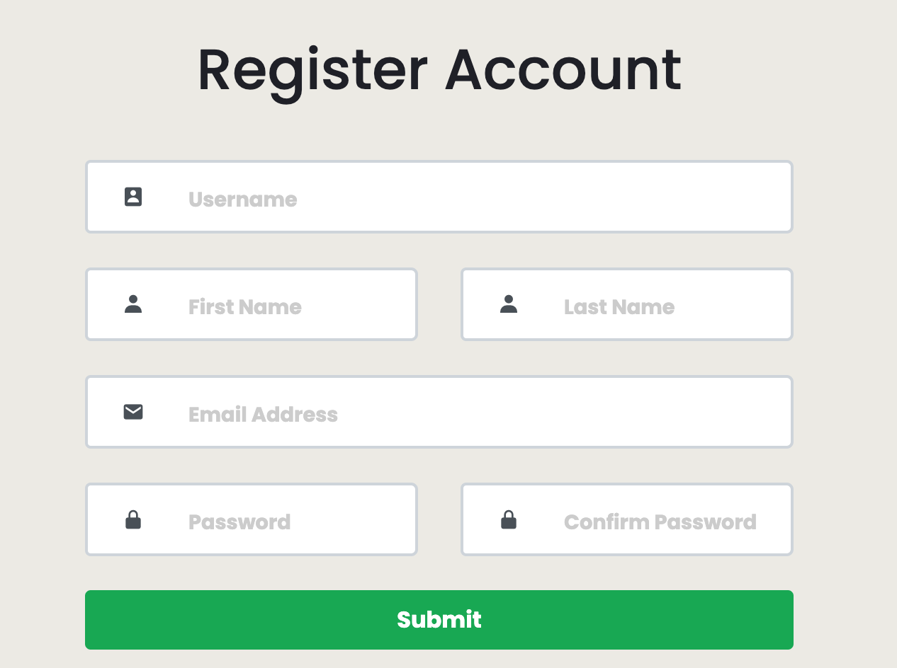

### Already Registered: 
If Already logged in then make sure you put in the right details that you made. Fill in the form seen below on the website.
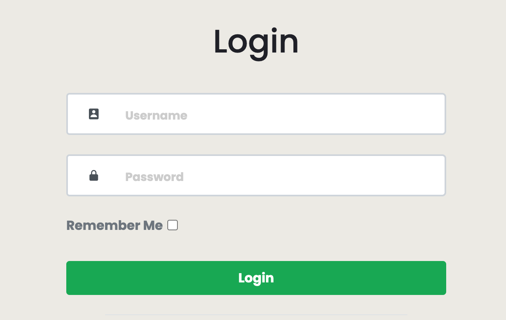

## Dashboard Page:
The Dashboard page is the first page that opens up when you log in. Here it explains how to navigate and use the webiste if you are having any troubles.

On the page it also has two buttons which contain System Information. If you select the data overview show in the red circle (shown below), you will be given a pop up page which explains the data which is stored for each sample type. If you select the "Examples Page" shown in the blue circle (also shown below), you'll be shown a example of the data fields. 

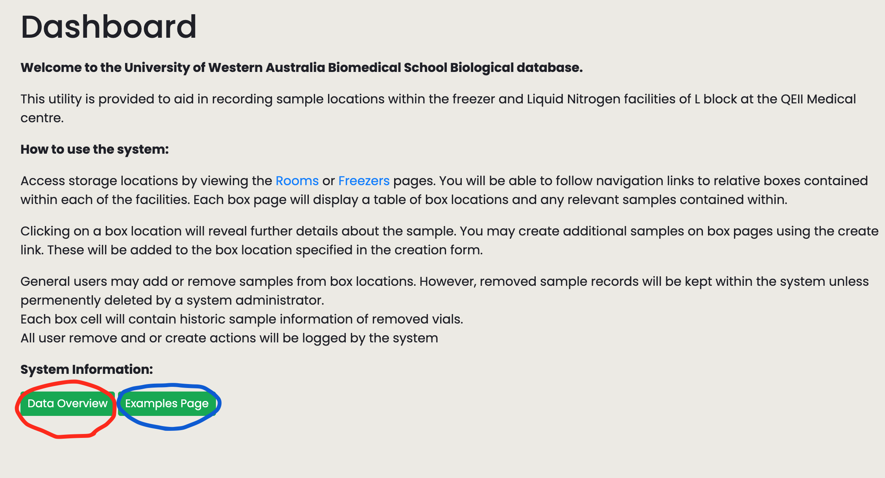

### Navigating the Website: 
Shown below is the sidebar which appear once you enter the website. Clicking on each name will take you to each indicated page. So to get to the dashboard page you select the where the blue circle is below. The people page may not be accessable for some user groups shown in the red circle. The buildings button circle in  yellow shows a green block indicating that is the current page you are on. The green circles are also other inventory pages you can access. 
Finally the purple circle shows the logout button. Remember to log out after using the website so no one is logged in as you after. 

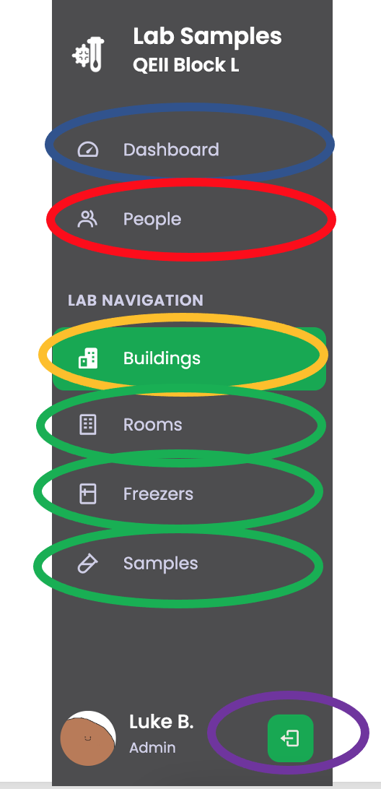

## People Page:
This page has authorised access if you want to delete a user or change a users access. ##Need to find what this access is## You first press on the edit button on the user that you wish to delete or edit. Then the form below pops up and has a select bar of which access group the user should be changed to. If this is to be changed then select the submit button. If wanting to delete a User then press the delete button. 

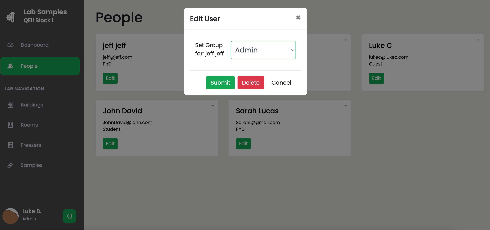

## Upload Page:
This page is only accessable by certain users. The upload page is ver basic and striaght forward. You choose the file which you would like to upload and then press upload. If the file was already uploaded then an error will be shown. Make sure the file you upload is an excel file with the template we provided you. If the file is all good then a message should appear saying uploaded!

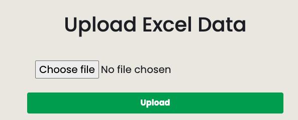

## Buildings Page:
The Buildings page displays all the buildings in the current database. You can add a new one by clicking the create button in the top right corner of the page (circled in blue below). 

Certain users also have privilage to edit the name or delete a building by pressing on the three dots in the top right corner of the building box (Shown in the red circle below).If you want to go into a certain building then select the "Enter" button in the building box (circled in yellow bellow).

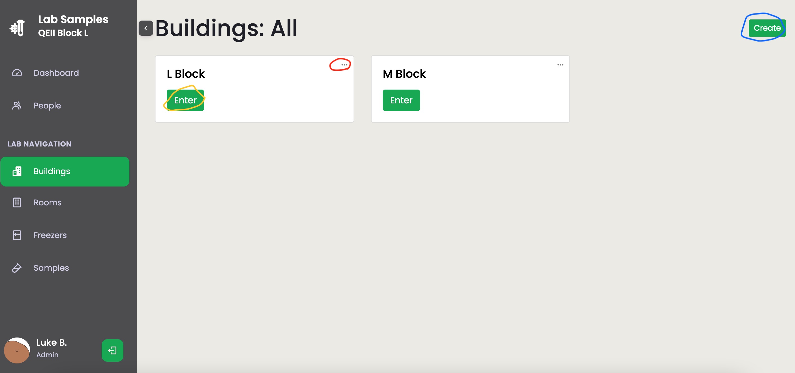

## Rooms Page:

The rooms page is very similar to the buildings page and has all the same features. If you came through the buildings page to the freezer section you are able to click in the top left corner to select back through to the buildings page. This also tells you which building you are in.

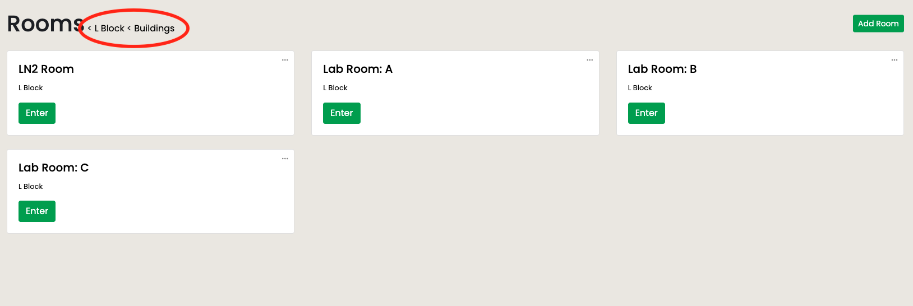

## Freezers Page:
Again freezers page very similar to the Rooms and Buildings page. The Freezer page allows you to pass onto the shelves or boxes page. (The shelves page becomes a tower page for the LN2 freezer).

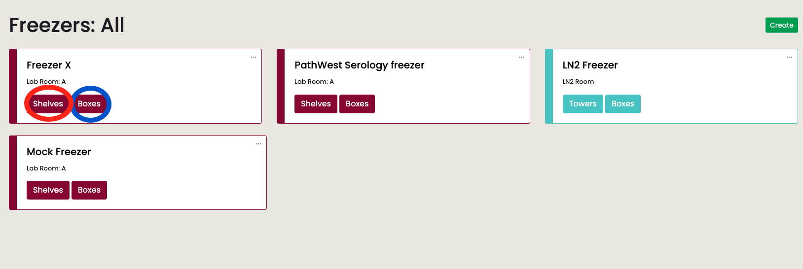

### Shelves and Boxes
Shown below are the Shelves and Boxes page. It again is similar to all the other inventory pages. For the shelves page select the enter button of which shelf you would like to enter and on the boxes the same applys. 

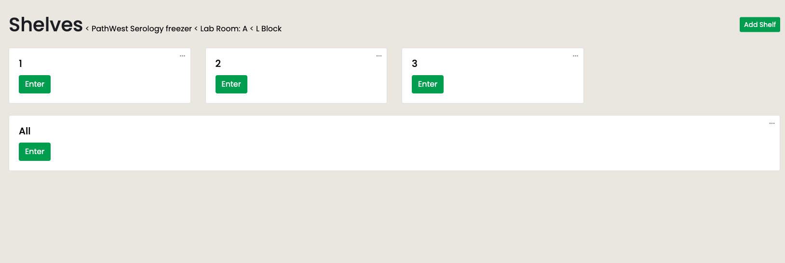 

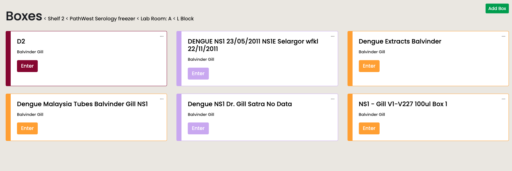

## Specific Box Page:
This page displays the box that you chose on the boxes page. It has all the slots and the vials in each slot. Once you have selected a slot you can either deposit a sample shown (the green button on the right of the page) or edit the current vial. You can deposit a sample if there is already one there as well, having multiple samples in one slot. The drop down will allow you to select from all the sample types available and choose which type you want to deposit into the slot. 

If you press the (three dot symbol) edit button on the top right of the vials info you will be displayed with a drop down. Which has edit, copy or remove. If you select remove you will remove the vial from the box. If you copy, then you are able to copy the vial to another position. If you edit the same form which you fill out to add a vial will be pop up but with the already filled in info being able to edit.  

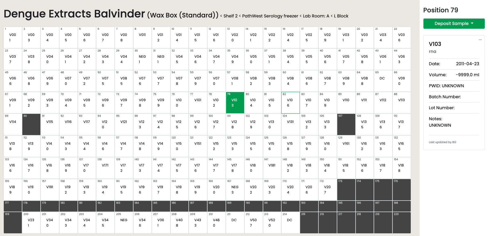 

The form to fill out the vial which you want to add or edit is shown below. Fill in each field and you should press submit (or cancel if you want to cancel your edits) to make the vial or change to the vial.

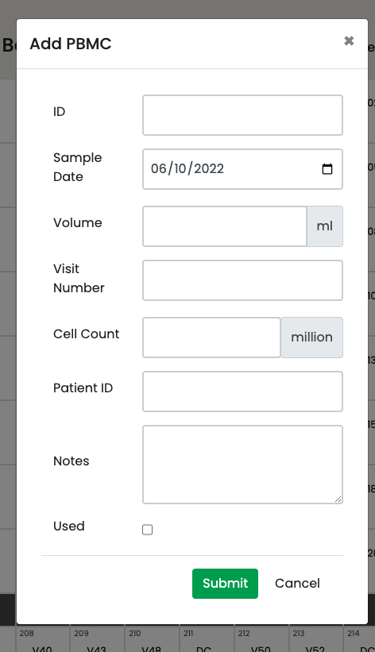

## Samples Page:
The Samples page is a search page. You can find the specific vial you are looking for. This is through all the parameters you can put in. 

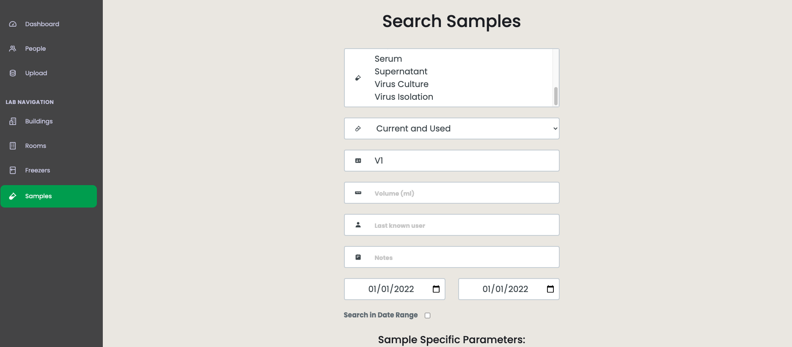 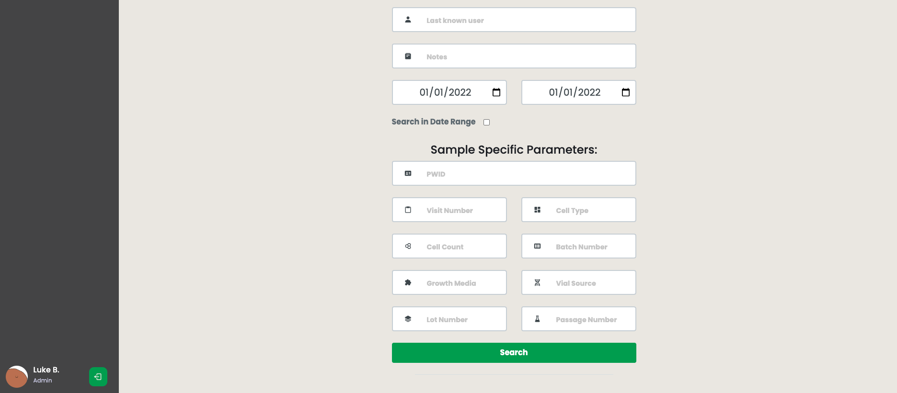

### Example
If I put "V1" into the Lab ID field I will get all the vials back which have "V1" in its Lab ID field. Shown below. You are able to see all the info relating to the vial and able to even delete or edit it. Also able to press the link back to the box page it retains to. 

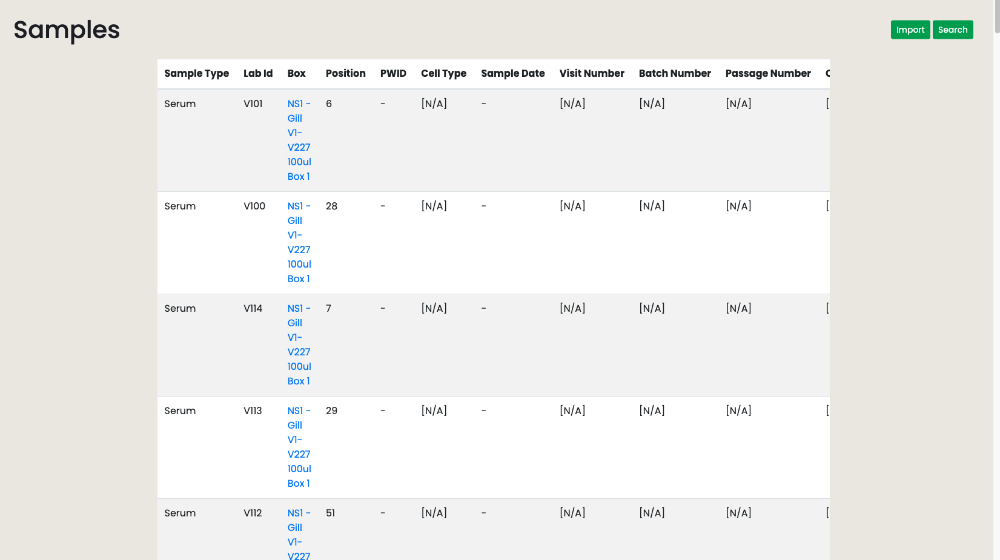